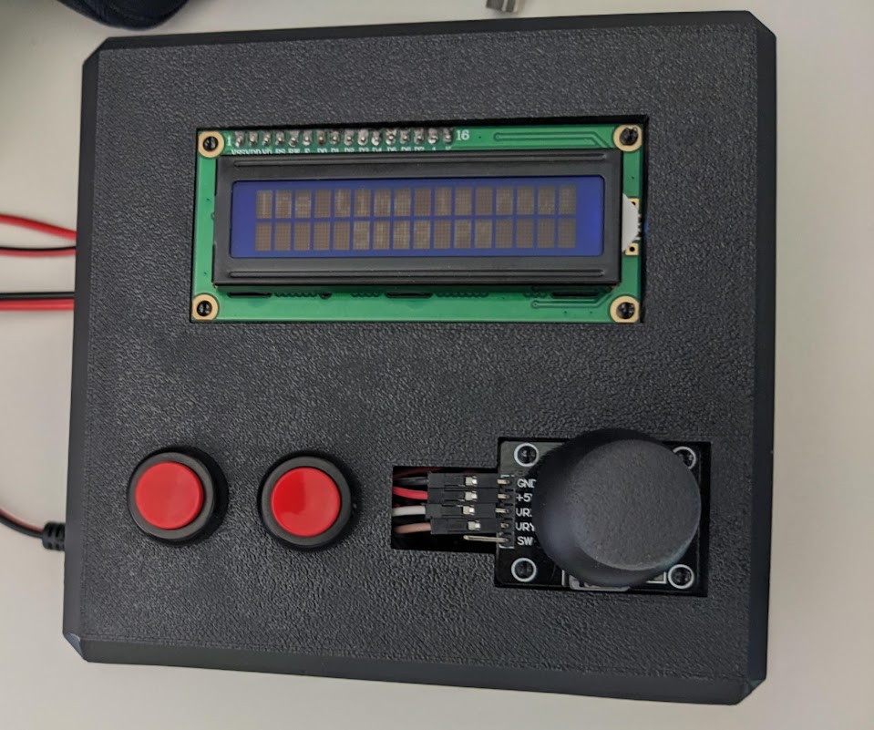

# Sunrise-Alarm-Clock-2025

Do you hate the sound of your alarm in the morning? Would you rather wake up peacefully, gently, and - most importantly - <i>quietly</i>?
If so, consider making a Sunrise Alarm Clock! This repo is part of an [instructable tutorial](https://www.instructables.com/DIY-Sunrise-Alarm-Clock-With-Arduino/) on how to do just that.

Note that Full_program_v3.5 is the most updated version; v4 is still in progress.

For those who don't want to click suspicious hyperlinked text: https://www.instructables.com/DIY-Sunrise-Alarm-Clock-With-Arduino/

## Clock User Instructions

### Display
Pressing the select button will turn the display on, which shows a user menu. From the menu, you can:

**Set Alarm Time** - 
This will lead to a series of menus where you can select AM/PM, hour, and minute (in 15-minute increments) for the desired
alarm time. Toggle the joystic up and down to change the values, and use the Select button to select desired values. Moving the
joystick to the right will also select the current value, while moving the joystick to the left will go back to the previous menu 
or cancel the set alarm process if there are no more previous menus. Currently, only one alarm can be set at a time.

**Set Current Time** - 
This works similarly to setting the alarm time, but it affects the current time stored by the clock module. Caution! Currently, it 
can only be set in 15-minute increments (0, 15, 30, 45).

**Move Time Forwards 1hr** -
This function is meant for daylight savings time; select this menu to move the current time forwards one hour.

**Move Time Backwards 1 hr** -
This function is meant for daylight savings time; select this menu to move the current time backwards one hour.

**Toggle Alarm** -
Selecting this menu option will not change the time set for the alarm, but will toggle its on/off state (ex. if the alarm was previously ON, 
it will be OFF after toggling, and vice versa). If the alarm is OFF, the light will not turn on even when the current time matches the set alarm time. 
This provides a quick and easy way to turn on/off the alarm for weekdays/weekends.

### Time Button
The leftmost button is the Time button, press it to display the current time. The display will turn off automatically after 5 seconds.

### Select Button
The rightmost button is the Select button, it is used for selecting menu options.

### Joystick
The joystick is used for switching between menus. It can also be used for selection and cancellation (the 'back' function) when setting times.

### Start/Reset
The current time must be set on program start, but afterwards it will retain the time even if the Arduino loses power, as long as there is a battery powering the RTC. 
However, currently any set alarm will have to be reset if the Arduino loses power or if the program is reset.

## Notes
- Note that v3.5 is the most updated version; v4 is still in progress.
- This code is still being updated and improved, check back for better and more robust versions of the program!

## Features to add
- Add unit testing framework
- Add interruptibility to all reads/displays, right now only some of them are interruptible
- Include a function to prevent the user from setting an alarm less than fadetime mins from now
- Edit program to use getFadeStartTime() instead of setFadeStartTime() - all tests for program first - this is refactoring
- Check that all functions to do with milliseconds and longs are subtraction - no addition to prevent rollover errors
- Add function so that looking at menus doesn't affect the light turning on or not
- Modify setHour() and setMin() functions to reduce coupling of cursor variable with magic number
- Add fun messages to print to lcd using displayTime
    - "The time is now..." 
    - LUNCHTIME
    - Why are you awake? You have 1 hrs, 39 mins, and 56 secs of sleep time left
    - 11AM!!! YOU'RE LATE FOR WORK/SCHOOL haha just kidding it's actually ___ (real time)
    - Do you really need to pee again? I need to sleep too...
    - ... it's the witching hour~~ ...
- Allow current time and/or alarm time to be set at any minute (not just 15-minute increments) - might use sliders for two unit places (eg. _ _ )
- Potentially add support for multiple alarms

## Changelog/Completed Features

v3.5 - Added functionality to prevent the time from resetting if the Arduino loses power (requires cell battery for the RTC module)

v3 - Added interruptibility for reading current time & displaying current alarm state - pressing the Select button returns to the mains menu

v3 - Added 'back' functions and cancellation for setting alarm/current time

v3 - Added menu options for daylight savings to move the current time ahead/behind 1 hr

v2 - More custom arrow icons, changed menu switch directions (up/down instead of left/right)

v1 - Added custom icons for arrows

v1 - Added a timer to automatically switch off the LCD after 25 secs of inactivity, which resets on button click/joystick movement

v1 - Created menus for setting alarm time & current time

v1 - Added LCD menu switching with the joystick

v1 - Added functionality to display the current time for 5 seconds on Time button press